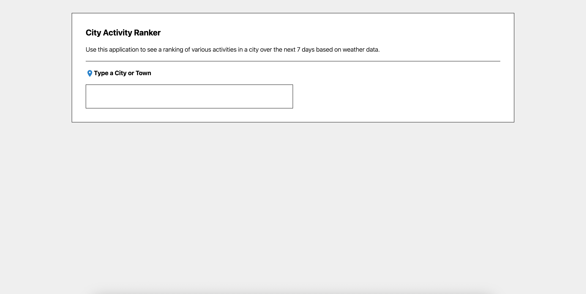
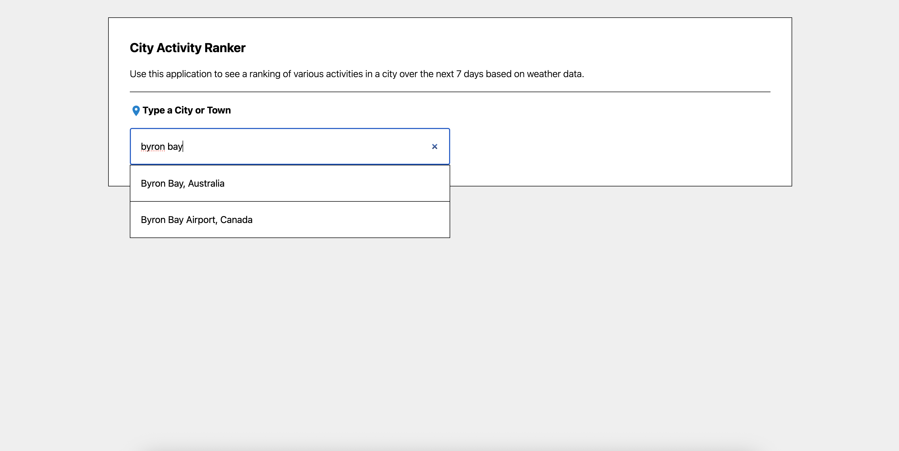
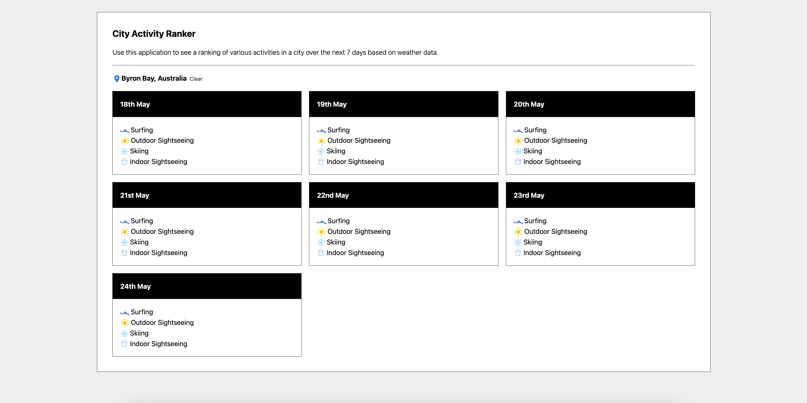
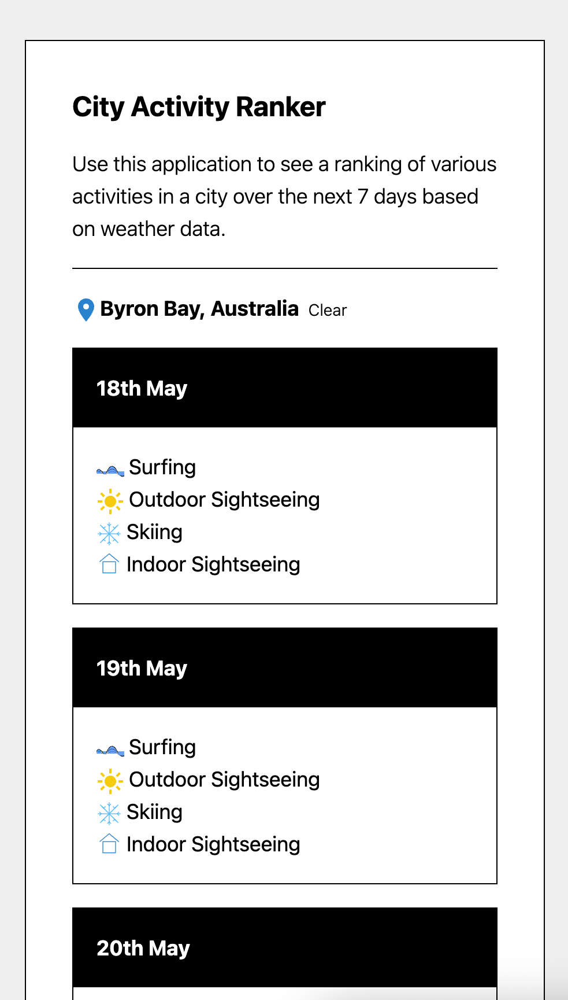

# Activities App

## Setup

To run the application -

- Clone the repo
- Install dependencies using `npm i`
- Run the server using `npm run dev-server`
- Run the client using `npm run dev`

## Key Technical Choices

- **React with TypeScript:** Chosen for building robust, type-safe UI components and leveraging the React ecosystem.
- **Apollo Client & Server:** Used for managing GraphQL queries on the client and exposing a flexible API layer on the server, enabling decoupled data fetching and aggregation from external APIs.
- **Vite:** Selected as the build tool for its fast development server, instant hot module replacement, and optimized production builds.
- **Tailwind CSS:** Adopted for utility-first, responsive styling, allowing rapid UI development with minimal custom CSS.
- **Custom Hooks:** Implemented to encapsulate data fetching and logic, promoting code reuse and separation of concerns in React components.
- **Centralized Type Definitions:** Shared types in `src/types` ensure consistency and type safety across both client and server code.
- **Modular Folder Structure:** The project is organized by feature and responsibility, making it easy to navigate, extend, and maintain.
- **Environment Configuration:** API endpoints and constants are centralized for easier management and environment-specific customization.
- **ESLint Integration:** Enforced code quality and consistency through linting, reducing bugs and improving maintainability.

## Architectural Highlights

- **Separation of Concerns:** The codebase is cleanly separated into client and server logic, with Apollo Client and Apollo Server code in distinct folders.
- **Type Safety:** TypeScript is used throughout, with shared types defined in `src/types` and imported across both client and server for consistency.
- **GraphQL API Layer:** All data fetching is performed via a GraphQL API, abstracting external API calls and providing a unified data interface to the client.
- **Reusable Hooks:** Custom React hooks (`src/hooks`) encapsulate data fetching and logic, promoting reusability and cleaner component code.
- **Component Modularity:** UI components are organized by feature and responsibility, with atomic components (icons, loader, alert) and feature components (autocomplete, forecast) in their own folders.
- **Styling:** Tailwind CSS is integrated for utility-first, responsive styling, keeping style definitions concise and maintainable.
- **Environment Configuration:** API endpoints and external URLs are centralized in `src/constants` for easy configuration and maintenance.
- **Scalable Structure:** The use of folders for icons, helpers, hooks, and types makes the project easy to extend and maintain as it grows.
- **Modern Tooling:** The project uses Vite for fast development builds, and ESLint for code quality, ensuring a modern and efficient developer experience.

### Folder Structure

- `src/components`: Contains all React components, organized by feature and atomicity.
- `src/icons`: SVG icon components for consistent UI visuals.
- `src/hooks`: Custom React hooks for encapsulating logic and data fetching.
- `src/helpers`: Utility functions for data transformation and business logic.
- `src/types`: Shared TypeScript types for strong typing across the app.
- `src/constants`: Centralized constants such as API endpoints.
- `src/apollo/client`: Apollo Client setup and GraphQL queries for the frontend.
- `src/apollo/server`: Apollo Server setup, schema, and resolvers for the backend.

### Data Flow

1. **User Interaction:** The user interacts with the UI (e.g., searching for a location).
2. **Hooks & Queries:** UI components use custom hooks to trigger GraphQL queries via Apollo Client.
3. **GraphQL Server:** The Apollo Server receives queries, fetches data from external APIs (Open Meteo), and returns normalized data.
4. **Type Safety:** Shared types ensure that data structures remain consistent between client and server.
5. **UI Rendering:** Components render data, using helpers for formatting and icons for visual cues.

### Extensibility

- **Adding Features:** New features can be added by creating new components, hooks, and GraphQL queries/mutations.
- **API Integration:** Additional external APIs can be integrated by extending server resolvers and updating types.
- **Styling:** Tailwind CSS makes it easy to adjust or extend the design system.
- **Testing & Linting:** The structure supports adding tests and uses ESLint for code quality.

## Trade-offs & Omissions

- **No State Management Library:** The app relies on React's built-in state and Apollo Client's cache, omitting more complex state management solutions (like Redux or Zustand) for simplicity.
- **No SSR/SSG:** The app is purely client-rendered with Vite; server-side rendering (SSR) or static site generation (SSG) is not implemented, which could impact SEO and initial load performance.
- **Minimal Error Handling:** Error handling is basic, mostly displaying error messages. More robust error boundaries or retry logic could be added.
- **Testing:** There are currently no automated tests (unit, integration, or E2E) included, which could affect long-term maintainability and reliability.
- **Authentication & Authorization:** The architecture assumes public APIs and does not include user authentication or authorization mechanisms.
- **Performance Optimizations:** Features like code splitting, lazy loading of components, or advanced caching strategies are not present but could be added for larger-scale applications.
- **Accessibility:** While Tailwind CSS is used for styling, explicit accessibility (a11y) considerations (like ARIA roles, keyboard navigation) are not detailed in the codebase.

## Thoughtful AI Use

- **Code Generation & Refactoring:** AI tools were leveraged to scaffold boilerplate code, suggest best practices, and refactor components for clarity and maintainability.
- **Documentation:** AI was used to generate and refine documentation, architectural highlights, and trade-off analyses, improving onboarding and knowledge sharing.

## Technical Shortcuts & Production Improvements

- **Minimal Error Handling:** Errors are surfaced as simple messages to the user.  
  _Production improvement:_ Implement comprehensive error boundaries in React, structured error logging, and user-friendly fallback UIs.

- **No Automated Testing:** The codebase lacks unit, integration, and end-to-end tests.  
  _Production improvement:_ Add automated tests for critical logic, components, and API endpoints to ensure reliability and support refactoring.

- **No Security Hardening:** No authentication, authorization, or input validation is present.  
  _Production improvement:_ Add input validation, sanitize user input, and implement authentication/authorization if sensitive data or user accounts are introduced.

- **No Build/Deployment Automation:** The project assumes manual local development.  
  _Production improvement:_ Set up CI/CD pipelines for automated testing, linting, and deployment.

- **Basic Performance Optimization:** No code splitting, lazy loading, or asset optimization.  
  _Production improvement:_ Enable code splitting, lazy load heavy components, and optimize static assets for faster load times.

- **No Monitoring or Analytics:** No error monitoring or usage analytics are included.  
  _Production improvement:_ Integrate tools like Sentry for error tracking and analytics platforms for usage insights.

- **No Internationalization:** Only English is supported.  
  _Production improvement:_ Add i18n support for broader accessibility.

- **Increased accessibility:** The application lacks comprehensive accessibility features.  
  _Production improvement:_ Conduct an accessibility audit and implement ARIA roles, keyboard navigation, and screen reader support. Add improved keyboard navigation and focus support (especially for the autocomplete component).

## Screenshots

| App                                        | Autocomplete                                    |
| ------------------------------------------ | ----------------------------------------------- |
|      |  |
| Ranking                                    | Mobile-friendly                                 |
|  |        |
